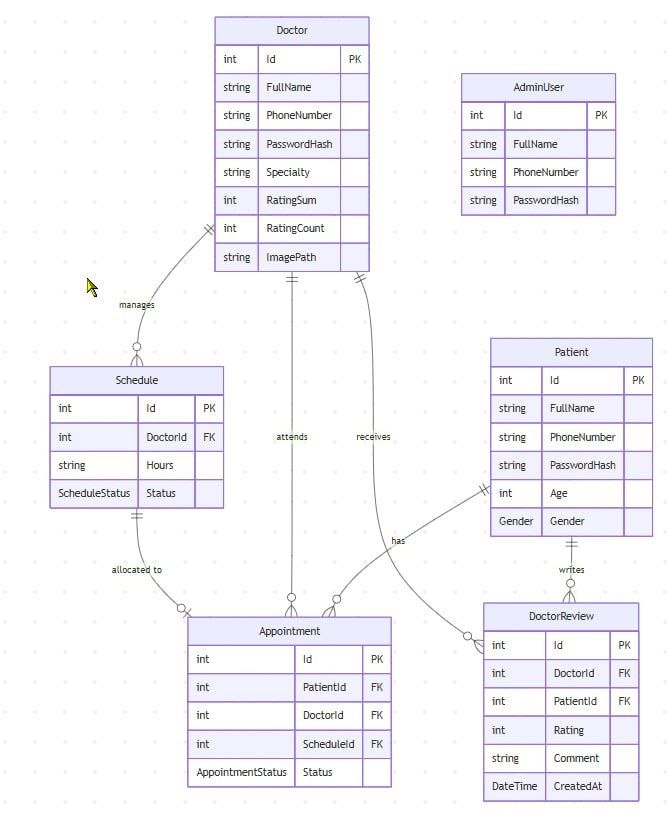
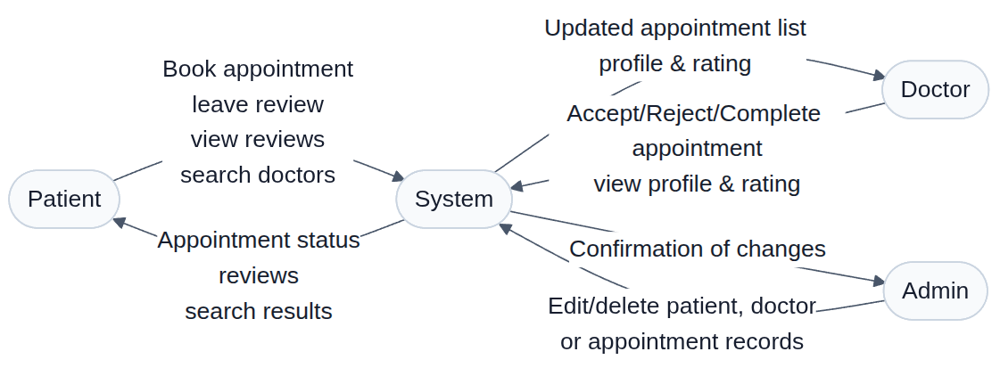

# Diacare — Doctor Appointment & Review Platform

Diacare is a comprehensive flask web application that connects patients with doctors. It streamlines appointment booking, enables patient reviews, and provides administrative control over all records. Built for efficiency and transparency, Diacare supports three distinct user roles: **Patient**, **Doctor**, and **Admin**.

## Features

### For Patients
- **Book Appointments** – Schedule appointments with available doctors.
- **Leave Reviews** – Rate and write reviews for doctors after an appointment.
- **View Reviews** – Read feedback left by other patients.
- **Search & Filter Doctors** – Find doctors by:
  - Name
  - Specialty (e.g., Cardiology, Dermatology)
  - Average Rating (1–5 stars)

### For Doctors
- **Manage Appointments** – Update appointment status:
  - ✅ Accept
  - ❌ Reject
  - ✔️ Complete
- **View Profile** – See personal details, specialty and phone number.
- **View Rating** – Check total reviews and average rating.

### For Admin
- **Full CRUD Control** – Edit or delete any record:
  - Patient records
  - Doctor records
  - Appointment records

---

## Tech Stack (Suggested)

| Layer          | Technology                        |
|----------------|-----------------------------------|
| Frontend       |      HTML + CSS + JavaScript      |
| Backend        |    PyMySQL + SQLAlchemy + Flask   |
| Database       |             MySQl Server          |
| Hosting        |     Local/Development Server      |

---

## ERD


---

## Data Flow Diagram


---

## Getting Started

### Prerequisites
- Flask 3.1.1
- Flask-SQLAlchemy 3.1.1
- PyMySQL 1.1.1
- cryptography 44.0.2
- MySQL Server 8.4.8

### Installation

1. **Clone the repository**
   ```bash
   git clone https://github.com/your-org/diacare.git
   cd Diacare
2. **Run the app**
   ```bash
   pip install -r requirements.txt
   python app.py
3. **Access the app**
   Open http://127.0.0.1:5220

---

### License
**GPL** 